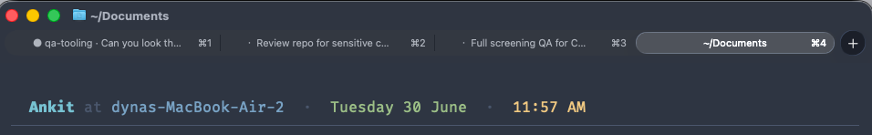

# claude-tab-context



A terminal tab is a terrible place to keep a thought. It shows you `zsh`, or a
folder name, or nothing at all — and the moment you have more than a couple of
Claude Code sessions running, every tab looks identical. You end up clicking
through all of them trying to remember which one was fixing the flaky test and
which was rewriting the auth flow. The map of what's-where lives only in your
head, and it falls apart fast.

This puts that map back into the tab bar. Each tab labels itself with what its
Claude session is actually up to — the project, the prompt that started it, and
whether it's working, finished, or waiting on you:

```
▸ dots · fix backspace in ghostty
✓ api  · add rate limiting to /v1/search
● web  · migrate to tailwind v4
```

Now one glance tells you the whole story: which session is busy, which is done,
and which one is sitting there waiting for you to come back.

It's a single small shell script — the only dependency is `jq` — wired in
through Claude Code's hooks. Anything that understands OSC 2 title sequences
works: Ghostty, iTerm2, kitty, WezTerm, Terminal.app, VS Code's terminal.

## Install

```
/plugin marketplace add ankitsxchdeva/claude-tab-context
/plugin install claude-tab-context@claude-tab-context
```

Open a new session and your tabs start labeling themselves. That's it.

## What the title shows

`<status> <project> · <prompt>`

- **status** — `▸` working · `✓` done (waiting for your next message) · `●`
  needs input (a permission prompt or other notification)
- **project** — the git repo name (or the working directory), leading dot
  stripped (`.dots` → `dots`)
- **prompt** — the session's **first** prompt, so quick follow-ups
  ("commit this", "now fix the test") don't relabel the thread

## Configuration

All optional, set as environment variables:

| Variable | Default | Effect |
|---|---|---|
| `CTC_SEP` | `" · "` | separator between project and prompt |
| `CTC_MAXLEN` | `40` | max prompt length |
| `CTC_PROJ_MAXLEN` | `16` | max project length |
| `CTC_WORKING` / `CTC_DONE` / `CTC_WAITING` | `▸` / `✓` / `●` | status glyphs |
| `CTC_LATEST` | unset | set to `1` to label with the latest prompt instead of the first |
| `CTC_TTY` | unset | force a target tty device (skip auto-detect) |

## Terminal notes

- **Ghostty:** if you've set a fixed `title = "..."` in your config, Ghostty
  **ignores all title escape sequences** — comment it out or this can't work.
  (A one-time gotcha, not specific to this plugin.)
- **tmux / screen:** the title is set on the pane's tty. To bubble it up to the
  outer terminal tab, add `set -g set-titles on` so tmux forwards the pane
  title.
- Any terminal honoring **OSC 2** works; there's no terminal-specific code.

## How it works (and a caveat)

Claude Code runs hooks **without a controlling terminal**, so the usual
`/dev/tty` write fails with `ENXIO` ("Device not configured"). This script
instead finds the session's real tty *device* (e.g. `/dev/ttys003`,
`/dev/pts/3`) by walking up the process tree, and writes the `OSC 2` sequence
there.

Newer Claude Code versions expose a hook-output `terminalSequence` field that
emits titles through Claude's own write path (race-free, tmux- and
Windows-safe). Where it's available that's a cleaner mechanism; this script's
tty approach is the dependency-free fallback that works today everywhere there
is a real tty.

## Standalone (no plugin)

Prefer to wire it into your own dotfiles? Copy `scripts/claude-tab-context` to
`~/.claude/hooks/` (make it executable with `chmod +x`), then merge the hooks
from [`examples/settings.snippet.json`](examples/settings.snippet.json) into
your `~/.claude/settings.json`.
